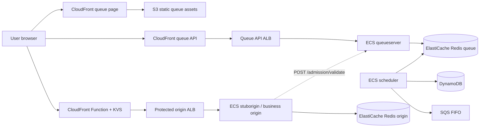
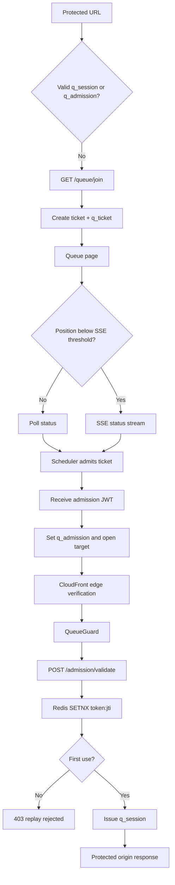

# Virtual Queue

An AWS-backed virtual waiting room for protecting a capacity-sensitive web origin during traffic spikes. Users join a FIFO queue, see their position through polling or Server-Sent Events (SSE), receive a short-lived admission token, and reach the protected origin only after the token is validated and redeemed.

## Scope

- Go queue API for joining, position/status updates, admission validation, queue exit, and admin operations.
- Go admission scheduler that removes tickets from Redis at the configured rate and publishes admission events.
- Static queue page served from S3 through CloudFront.
- CloudFront-protected stub/business origin used to verify the admission flow.
- Redis data stores for queue state and origin-side token/session state.
- DynamoDB tables for sessions, events, and audit records.
- FIFO SQS admission-events queue for AWS-side event integration.
- SSM Parameter Store for application configuration and secrets.
- CloudFront Key-Value Store for edge verification secrets.
- Terraform modules for networking, ECS/Fargate, ALBs, Redis, DynamoDB, SQS, S3, and CloudFront.
- Local and AWS smoke-test scripts, including the 20-user test.

## Components and services

| Component | Responsibility | Implementation |
| --- | --- | --- |
| Queue page | Shows position, transport, wait state, and admission progress | `web/queue/` |
| Queue API | Creates tickets, serves poll/SSE status, validates admission, and exposes admin APIs | `cmd/queueserver`, `internal/api/` |
| Scheduler | Admits tickets in FIFO order, respecting rate/capacity, and publishes updates | `cmd/scheduler` |
| Queue Redis | Sorted-set queue, ticket metadata, counters, and pub/sub updates | `internal/store/`, ElastiCache `redis_queue` |
| QueueGuard | Protects the origin, validates cookies/tokens, calls queue validation, and enforces one-time redemption | `pkg/middleware/queue_guard.go` |
| Stub/business origin | Example protected application/checkout endpoint | `cmd/stuborigin` |
| Origin Redis | One-time admission-token redemption and active-session state | ElastiCache `redis_origin` |
| Static content | Queue shell and assets | S3 + CloudFront |
| Edge guard | Checks `q_admission` and `q_session` before forwarding origin requests | CloudFront Function + KVS |
| Runtime | Runs queue API, scheduler, and stub origin containers | ECS/Fargate |
| Configuration | Keeps application values outside Terraform | SSM + `scripts/set-ssm-config.sh` |
| Observability | Container logs and deployment evidence | CloudWatch Logs + `scripts/capture-aws-evidence.sh` |

## AWS architecture



```text
User browser
  -> CloudFront queue-page distribution
  -> S3: queue/index.html, queue.js, queue.css

User browser
  -> CloudFront queue-api distribution
  -> Public ALB
  -> ECS/Fargate: queueserver
  -> ElastiCache Redis: queue sorted set + ticket state

ECS/Fargate: scheduler
  -> ElastiCache Redis: FIFO admission + pub/sub updates
  -> SQS FIFO: admission-event integration
  -> DynamoDB: event/audit records

User browser
  -> CloudFront protected-origin distribution
  -> CloudFront Function + KVS: verify q_admission/q_session
  -> Public ALB
  -> ECS/Fargate: stuborigin/business origin
  -> ElastiCache Redis: token redemption + active sessions
  -> Queue API /admission/validate: ticket/event binding check
```

Terraform creates the VPC, public/private subnets, NAT gateway, security groups, ALBs, ECS cluster/services, ElastiCache Redis, DynamoDB, SQS, S3, CloudFront distributions, CloudFront Function, and CloudFront KVS. Application configuration is read from SSM and is not created by Terraform.

## End-to-end flow



### 1. Join the queue

```text
User opens protected URL
  -> CloudFront Function checks cookies
  -> no valid q_session/q_admission
  -> redirect to Queue API GET /queue/join
  -> queueserver creates ticket and q_ticket capability cookie
  -> Redis ZADD queue:{eventId}
  -> redirect to static queue page with ticket and target URL
```

### 2. Polling and SSE

```text
Queue page loads
  -> GET /queue/status/{ticketId}?mode=poll
  -> queueserver authenticates q_ticket
  -> Redis ZRANK returns position
  -> position >= SSE_THRESHOLD: continue polling
  -> position < SSE_THRESHOLD: upgrade to SSE
  -> GET /queue/status/{ticketId}?mode=sse
  -> Redis pub/sub sends position and admission updates
```

The UI displays the active transport as `Polling` or `SSE`. Users farther from the front poll; users near the front receive faster updates over SSE.

### 3. Admission

```text
Scheduler tick
  -> read rate, capacity, and active-session counters from Redis
  -> calculate batch = min(admit rate, available capacity)
  -> ZPOPMIN queue:{eventId}
  -> issue HMAC admission JWT
  -> store token on ticket:{ticketId}
  -> publish admitted event to ticket updates channel
  -> write audit/event data to DynamoDB and SQS
  -> queue page receives token through poll or SSE
  -> browser sets q_admission and navigates to target URL
```

### 4. Origin validation and redemption

```text
Browser requests protected origin with q_admission
  -> CloudFront Function verifies ADMISSION_SECRET from KVS
  -> request reaches stuborigin/business origin
  -> QueueGuard verifies the JWT
  -> POST /admission/validate with ticketID + token + internal API token
  -> queueserver verifies JWT, ticket binding, and event binding
  -> origin Redis SETNX token:{jti}
  -> first use succeeds; replay fails
  -> origin issues q_session and clears q_admission
  -> business handler responds
```

Subsequent requests use the session cookie:

```text
Browser request with q_session
  -> CloudFront Function verifies SESSION_SECRET from KVS
  -> origin QueueGuard validates q_session
  -> business origin responds
```

On checkout completion or exit:

```text
Origin
  -> POST /queue/exit
  -> origin Redis DECR active:{eventId}
  -> scheduler admits the next user on a later tick
```

## Queue API

| Method | Endpoint | Purpose | Protection |
| --- | --- | --- | --- |
| `GET` | `/health` | Health check | Public |
| `GET` | `/queue/join?eventId=...&target=...` | Create/resume ticket and redirect to queue page | Public entry point |
| `GET` | `/queue/status/:ticketId?mode=poll` | Return position or admission token | `q_ticket` cookie |
| `GET` | `/queue/status/:ticketId?mode=sse` | Stream position/admission events | `q_ticket` cookie |
| `POST` | `/admission/validate` | Validate token and ticket/event binding without consuming it | `X-Internal-API-Token` |
| `POST` | `/queue/exit` | Decrement active-session count | Internal path |
| `PUT` | `/queue/rate/:eventId` | Update admission rate and capacity | `X-Internal-API-Token` |
| `GET` | `/queue/config/:eventId` | Read depth, rate, capacity, active users, and drain estimate | `X-Internal-API-Token` |
| `GET` | `/queue/events` | List queue event IDs | `X-Internal-API-Token` |
| `GET` | `/queue/events/:id/page-upload-url` | Create an S3 page upload URL | `X-Internal-API-Token` |

## Security model

```text
ADMISSION_SECRET
  -> signs admission JWTs
  -> verifies q_admission at CloudFront and origin

SESSION_SECRET
  -> signs q_session cookies
  -> verifies ongoing sessions at CloudFront and origin

INTERNAL_API_TOKEN
  -> protects queue validation and admin endpoints

q_ticket capability cookie
  -> authorizes status access for the matching ticket only

Redis SETNX token:{jti}
  -> prevents admission-token replay at the origin
```

Configure these eight SSM parameters per environment:

```text
/virtual-queue/<environment>/ADMISSION_SECRET
/virtual-queue/<environment>/SESSION_SECRET
/virtual-queue/<environment>/INTERNAL_API_TOKEN
/virtual-queue/<environment>/DEFAULT_ADMIT_RATE
/virtual-queue/<environment>/SSE_THRESHOLD
/virtual-queue/<environment>/SCHEDULER_TICK_SECS
/virtual-queue/<environment>/QUEUE_JOIN_URL
/virtual-queue/<environment>/QUEUE_VALIDATION_URL
```

After Terraform creates the CloudFront KVS, copy `ADMISSION_SECRET` and `SESSION_SECRET` with `scripts/set-cloudfront-kvs.sh`.

## Local development

Prerequisites: Go, Docker Compose, Python 3, and curl.

```bash
cp .env.example .env
# Fill in .env. Keep ADMISSION_SECRET and SESSION_SECRET different.
make up
make verify
make test
make simulate
```

Local endpoints:

```text
Queue API:       http://localhost:8080
Stub origin:     http://localhost:8081
Static queue UI: http://localhost:8082/queue/index.html
```

`make verify` checks health, join, polling, SSE, admission redemption, replay rejection, Redis SETNX, and secret isolation. `make simulate` runs multiple independent clients against the local queue API.

## AWS deployment and testing

Terraform is under `infra/environments/dev/`. The module structure can be reused for another environment with its own variable file and SSM prefix.

```bash
cd infra/environments/dev
terraform init
terraform plan -var-file=terraform.tfvars
terraform apply -var-file=terraform.tfvars
cd ../..
```

Before the first apply, create/update all eight SSM values:

```bash
set -a
source .env
set +a
./scripts/set-ssm-config.sh dev
```

After apply, populate CloudFront KVS:

```bash
./scripts/set-cloudfront-kvs.sh dev
```

Container builds, ECS updates, and static-page publication are normally driven by GitHub workflows. Terraform owns infrastructure; SSM owns application configuration.

Run the 20-user AWS smoke test:

```bash
QUEUE_API_BASE=https://<queue-api-cloudfront-domain> \
QUEUE_TEST_COUNT=20 \
WAIT_SECS=360 \
./scripts/test-aws-queue.sh
```

The script creates 20 separate cookie jars and tickets, then verifies the 20th user’s authenticated poll-to-SSE transition and admission event. It does not call `/admission/validate`; that endpoint is exercised when the admitted browser opens the protected origin.

For browser screenshots, network evidence, and CloudWatch records:

```bash
./scripts/capture-aws-evidence.sh
```

## Repository guide

```text
cmd/                         Service entrypoints
internal/api/                Queue API handlers and routes
internal/config/             Environment configuration loading
internal/store/              Redis keys and queue operations
internal/token/              Admission JWTs, sessions, and status secrets
pkg/middleware/              Origin QueueGuard
web/queue/                   Queue page HTML/CSS/JavaScript
web/admin/                   Admin page assets
infra/modules/               Reusable Terraform modules
infra/environments/dev/      Environment composition and variables
scripts/                     Local/AWS verification and configuration scripts
DESIGN.md                    Detailed design rationale and data model
```

## Verification status

The AWS dev flow has been exercised with 20 independent users: queue joins succeeded, the 20th user moved from polling to SSE, admission was received, and the protected checkout flow called `POST /admission/validate` successfully before returning the checkout page.
